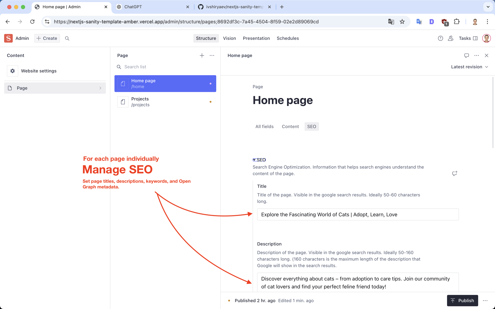

# ivshiryaev-nextjs-sanity-template

A Next.js + Sanity CMS template for creating fully dynamic websites with an admin panel for content management.

## Features
- **Dynamic Admin Panel**: Manage, edit, preview, and delete content at `/admin`.
- **Fully Responsive Design**: Powered by Tailwind CSS.
- **Draft Mode**: Toggle draft content visibility for seamless testing.
- **Dynamic Routing**: Automatically generates pages based on content.

## Tech Stack
- **Frontend**: Next.js, React, Tailwind CSS
- **Backend**: Sanity CMS
- **API**: Custom API routes for draft and publish functionality
- **Utilities**: ESLint, PostCSS, Prettier

## Directory Structure
```plaintext
- app/: Contains all the pages and layout components.
- components/: Reusable components such as Navbar, Footer, etc.
- sanity/: Sanity-related configurations and schemas.
- api/: API routes for custom features like draft management.
- lib/: Utility functions for shared logic.
```

## Screenshots


